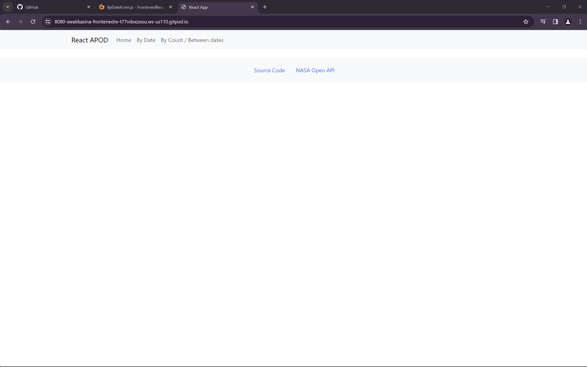
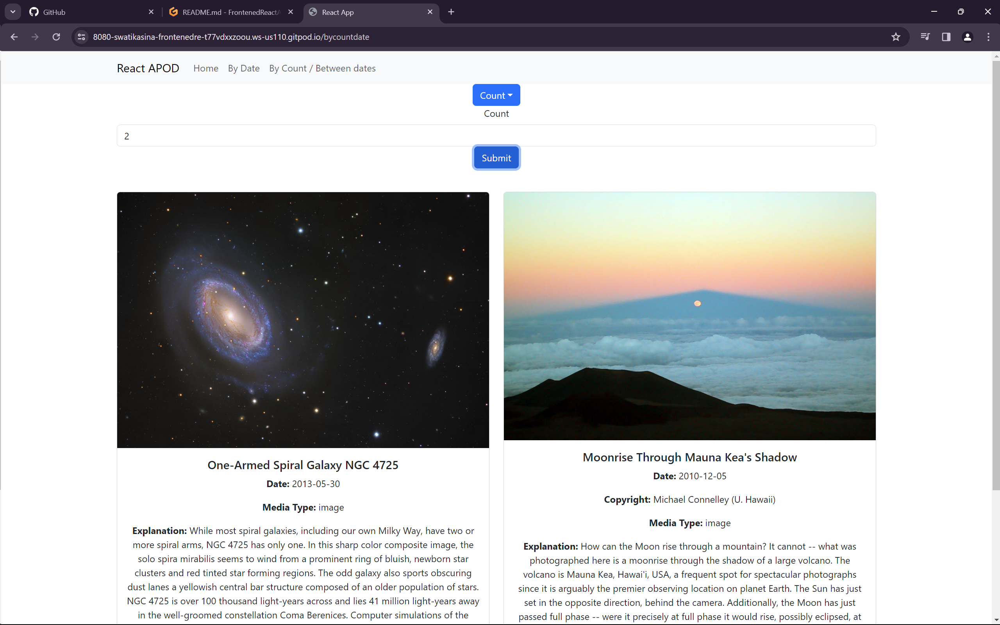
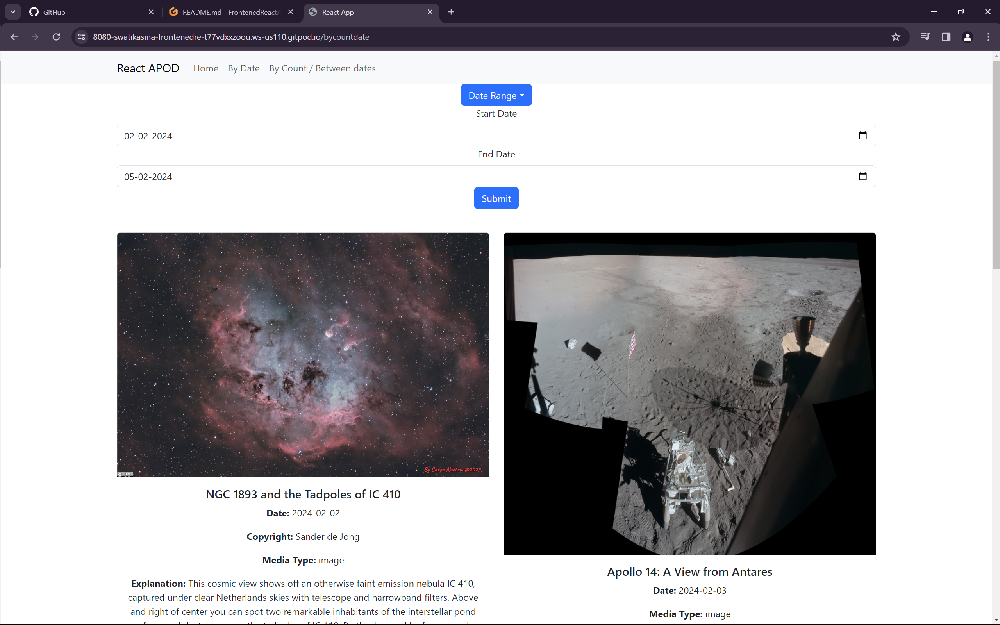

# Web Development Assignment 2

This project is Assignment 2 for the Web Development course. It consists of a web application built using React for the frontend and Spring Boot for the backend.

## Project Structure

```
.
├── Assignment2FrontEnd            # Frontend (React) directory
│   ├── public                     # Public directory for static assets
│   │   └── ...                    # Various static files (favicon, manifest, etc.)
│   ├── src                        # Source directory for React components
│   │   └── ...                    # React components, CSS, and other files
│   ├── package.json               # npm package configuration file
│   ├── README.md                  # README file for the frontend
│   └── webpack.config.js          # Webpack configuration file
├── springbootapp                  # Backend (Spring Boot) directory
│   ├── src/main                  # Source directory for Java classes and resources
│   │   ├── java/com/example/demo # Java classes (Controllers, Application class, etc.)
│   │   └── resources             # Resources (application properties, static files, templates)
│   │       ├── static            # Static files served by Spring Boot
│   │       └── templates         # Thymeleaf templates (if used)
│   ├── build.gradle              # Gradle build script
│   ├── gradlew                   # Gradle wrapper script
│   ├── gradlew.bat               # Gradle wrapper script for Windows
│   ├── settings.gradle           # Gradle settings file
│   └── README.md                 # README file for the backend
├── images                        # Directory containing project images
│   └── ...                       # Various images used in the project
├── log.txt                       # Log file (if applicable)
├── package.json                  # npm package configuration file (if applicable)
├── package-lock.json             # npm package lock file (if applicable)
├── README.md                     # Main README file for the project
├── tmp.txt                       # Temporary file (if applicable)
└── webpack.config.js             # Webpack configuration file (if applicable)
```

## Features

- **Frontend (React)**: The frontend is built using React, a JavaScript library for building user interfaces. It includes components for displaying home page, forms, and other features.

- **Backend (Spring Boot)**: The backend is built using Spring Boot, a Java-based framework for building web applications. It provides RESTful APIs to interact with the frontend and serves static resources.

## Setup and Usage

1. **Frontend Setup**:
   - Navigate to the `Assignment2FrontEnd` directory.
   - Install dependencies: `npm install`.
   - Run the development server: `npm start`.

2. **Backend Setup**:
   - Navigate to the `springbootapp` directory.
   - Build the Spring Boot project: `./gradlew build`.
   - Run the Spring Boot application: `./gradlew bootRun`.

3. **Accessing the Application**:
   - Once both frontend and backend are running, access the application in your web browser.

## Credits

- Developed by Swati K







## Available Scripts

In the project directory, you can run:

### `npm start`

Runs the app in the development mode.\
Open [http://localhost:3000](http://localhost:3000) to view it in your browser.

The page will reload when you make changes.\
You may also see any lint errors in the console.

### `npm test`

Launches the test runner in the interactive watch mode.\
See the section about [running tests](https://facebook.github.io/create-react-app/docs/running-tests) for more information.

### `npm run build`

Builds the app for production to the `build` folder.\
It correctly bundles React in production mode and optimizes the build for the best performance.

The build is minified and the filenames include the hashes.\
Your app is ready to be deployed!

See the section about [deployment](https://facebook.github.io/create-react-app/docs/deployment) for more information.
